## 주소 행정구역 마이그레이션

프로젝트를 하면서 행정구역별로 검색하는 시스템이 필요했다.  
행정구역별로 DB화된 API를 제공하는 곳이 있을 줄 알았지만 없어서 직접 만들어 봤다.  
도로명주소 API에서 제공하는 주소 DB를 이용해서  
행정구역(시/도, 시/군/구, 읍/면/동) 3단계로 나누는 작업을 하였다.  

크게 

#### 1. 도로명주소 주소 DB 다운  
#### 2. Excel로 불필요 데이터 정리 후 저장(addr.xlsx)  
#### 3. Toad 툴로 임시 테이블(test) create / Import 후 쿼리를 이용하여 데이터 정제  
#### 4. 정제된 데이터 Excel 파일로 Export(area.xlsx)  
#### 5. Toad 툴로 실제 테이블(AREA_TB) Create 후 Excel 파일 Import  

​
### 1. 도로명주소 안내시스템에서 제공하는 주소 DB를 다운 받는다.
1) 도로명주소 시스템의 개발자센터에서  
    주소DB제공 -> 도로명 주소 DB 다운로드 -> 주소 DB -> 최신 전체자료 다운로드  

​2) 다운로드 받은 주소 DB의 압축을 풀면 개선_도로명코드_전체분.txt 파일이 있다.  
```
111102005001|세종대로|Sejong-daero|00|서울특별시|Seoul|종로구|Jongno-gu|||2||0||||
111102005001|세종대로|Sejong-daero|01|서울특별시|Seoul|종로구|Jongno-gu|세종로|Sejongno|1|119|0||||
111102005001|세종대로|Sejong-daero|02|서울특별시|Seoul|종로구|Jongno-gu|종로1가|Jongno 1(il)-ga|1|126|0||||
111102100001|삼일대로|Samil-daero|00|서울특별시|Seoul|종로구|Jongno-gu|||2||0||||
....생략
```

### 2. EXCEL을 이용해서 해당 파일을 import와 불필요 데이터 정리 후 저장
#### 1) 외부 데이터 가져오기에서 텍스트 클릭  
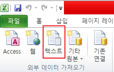  


#### 2) 구분기호로 분리됨 선택, 한국어 선택, 다음
구분기호 | 로 나누어져 있기 때문에 구분기호로 분리됨 체크   
한국어 선택  
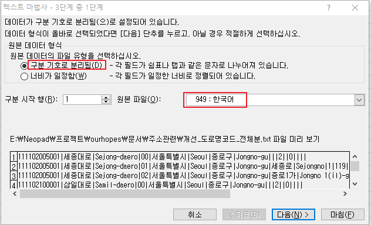  
  

#### 3) 데이터가 "|" 기호로 구분되어 있기 때문에 기타 "|"를 넣어준다.  
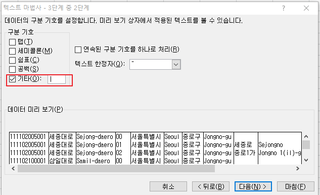  
  
​
#### 4) 데이터의 타입에 따라 각 열의 데이터 타입을 설정한다.  
- 지금 사용하고자하는 데이터는 모두 텍스트라 기본설정인 일반으로 했다.  
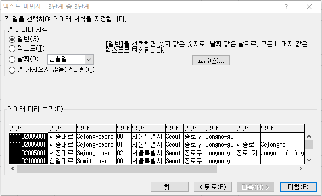  
  

#### 5) 결과는 이렇게 나온다. 이게 끝이 아니다!  
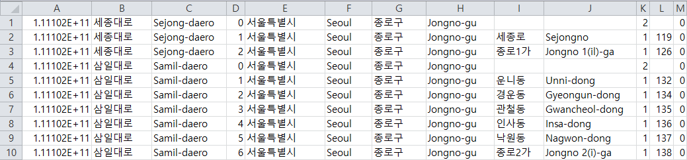​  
  

#### 6) 시/도, 시/군/구, 읍/면/동 이 관련된 행정구역 컬럼을 제외한 나머지 열은 삭제 후 저장한다.
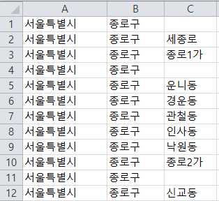​  
  
​

### 3-1. 임시 테이블(test) 생성 후 Toad를 이용해서 주소 데이터 Excel 파일 Import 
#### 1) 임시 테이블(test) create
```
create table test(						-- 지역구 테이블
  area_id int AUTO_INCREMENT primary key,	-- 지역 인덱스
  city varchar(30),							-- 시/도
  county varchar(30),						-- 시/군/구
  town varchar(20)							-- 읍/면/동
);
```

#### 2) Tools -> Import -> Import Wizard 클릭
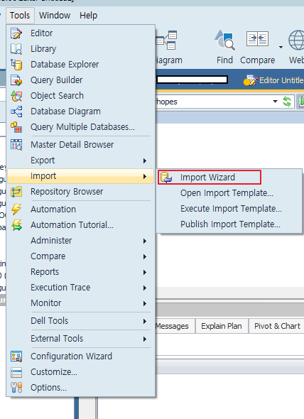​  
  
​
#### 3) Add File 선택 -> 해당 파일 선택 
  

#### 4) Options은 Empty fileds are null(빈 값 null로 채움) 설정 후 Next
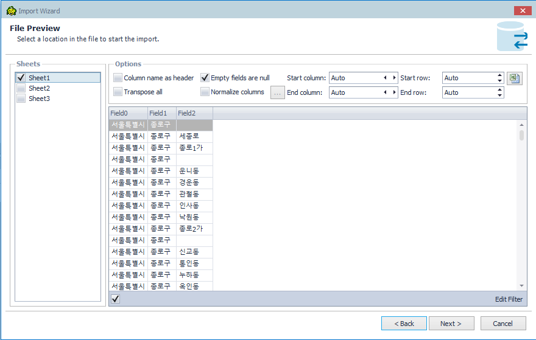​  
  
​
#### 5) 컬럼 추가 없이 Next
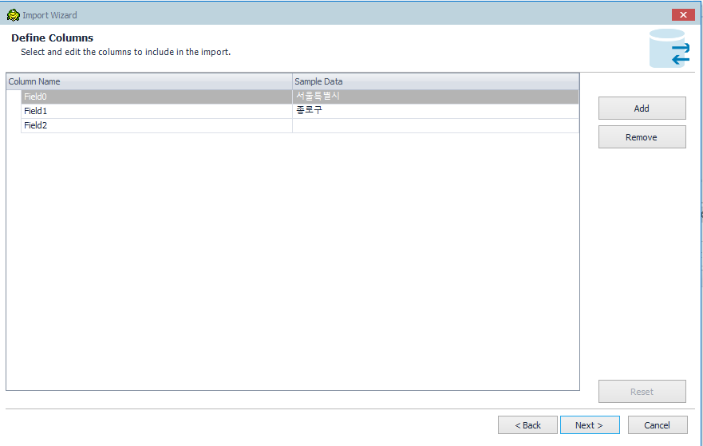​ 
  

#### 6) 이미 create한 임시테이블(test) 선택 후 엑셀의 열과 테이블의 컬럼을 맞춰줌
- area_id 는 시퀀스 자동 증가로 Skip This Column!  
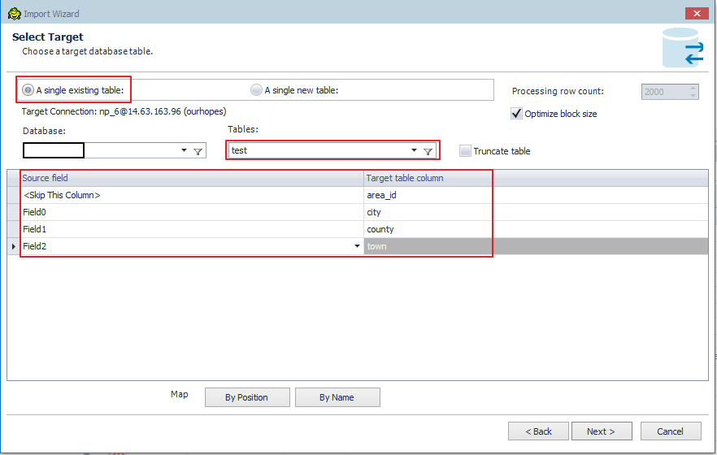​ 
  

#### 7) 나머지는 별 다른 설정없이 next 후 Import -> OK
- Null, 중복 값이 있다!!!  
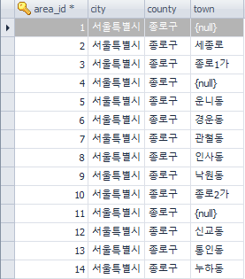​ 
- 임시테이블에 Import한 데이터(Null, 중복 값 O)  
  
​

### 3-2. 주소 관련 데이터를 Import한 임시 테이블(test)에서 쿼리를 이용해서 데이터 정제
- Null, 중복 제거  
    - Null, 중복 값 제거 후 시퀀스 뒤죽박죽.....  
```
SELECT * FROM test WHERE town IS NOT NULL GROUP BY city, county, town ORDER BY area_id ASC;
```
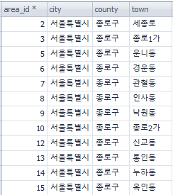​ 
- Null, 중복 제거한 데이터  

​

### 4. 정제한 데이터 Excel 파일로 Export(area.xlsx) 
#### 1) Select 조회한 데이터 우클릭 Export 선택  

#### 2) Format Excel 선택 후 Next
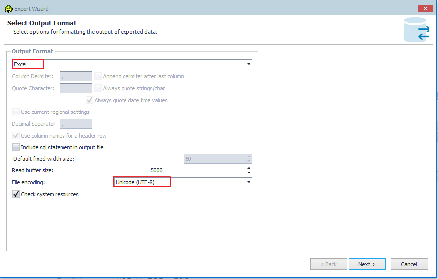​  

#### 3) 컬럼 확인 후 Next
​  

#### 4) 저장할 Excel 파일 경로 설정 후 Next -> Finish
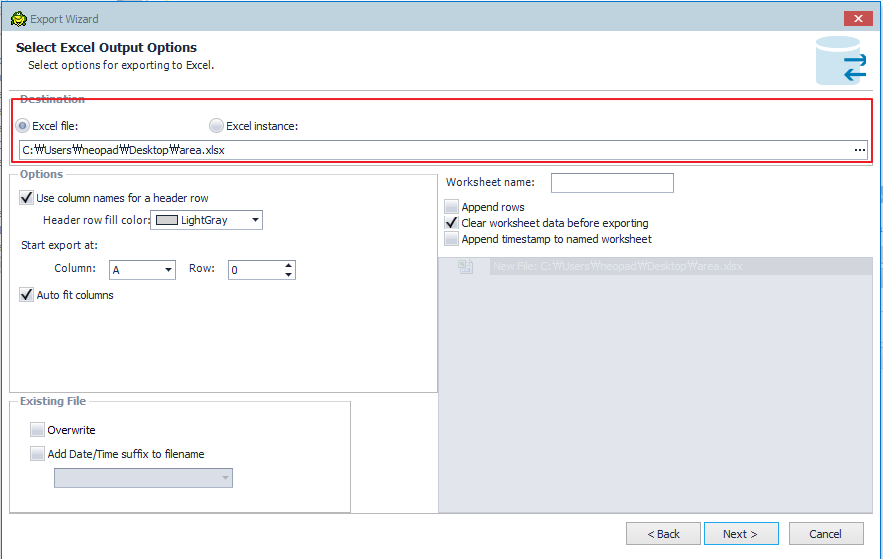​  

#### 5) 해당 경로에 파일 생성(area.xlsx)
​  
- Null, 중복 값 제거한 행정구역 데이터  

​

### 5. 실제 사용할 테이블(AREA_TB)에 데이터 정제된 Excel 파일(area.xlsx) Import
#### 1) 실제 사용할 행정구역 테이블(AREA_TB) 생성
```
create table AREA_TB(						-- 지역구 테이블
  area_id int AUTO_INCREMENT primary key,	-- 지역 인덱스
  city varchar(30),							-- 시/도
  county varchar(30),						-- 시/군/구
  town varchar(20)							-- 읍/면/동
);
```

#### 2) area.xlsx의 1행에 컬럼 name이 있으므로 Column name as header 체크 후 Next
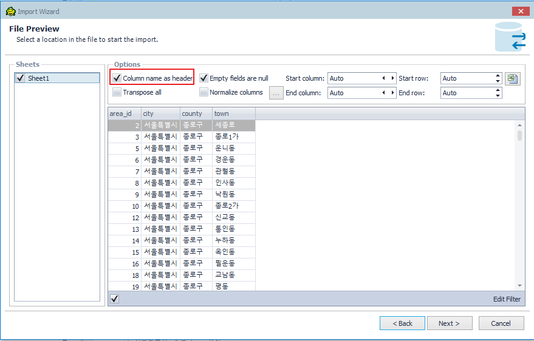​ 

#### 3) 실제 사용할 테이블 선택 / 컬럼 확인 후 Next
    - 삭제된 데이터가 있으므로 시퀀스 값이 뒤죽박죽...
        - area_id 컬럼 <Skip This Column> 선택하여 시퀀스 자동 증가 다시 설정
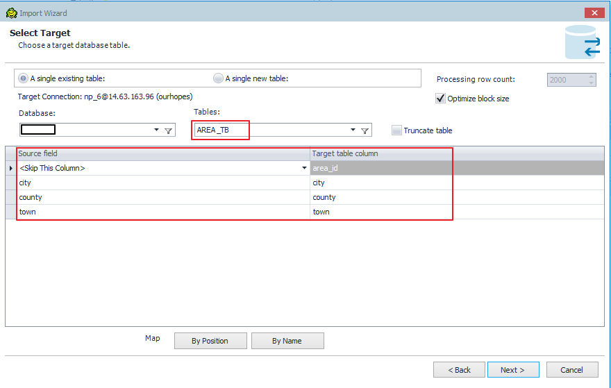​ 

#### 4) AREA_TB 테이블에 실제 사용할 데이터 결과
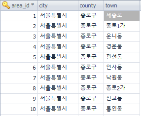​ 


​이렇게 도로명주소 시스템에서 제공하는 주소 DB를 이용하여 행정구역별로 DB화 하는 작업을 하였다!
더 좋은 방법이 있으면 나중에 다시 수정해야겠다!


### 데이터 출처 : [도로명주소](http://www.juso.go.kr)